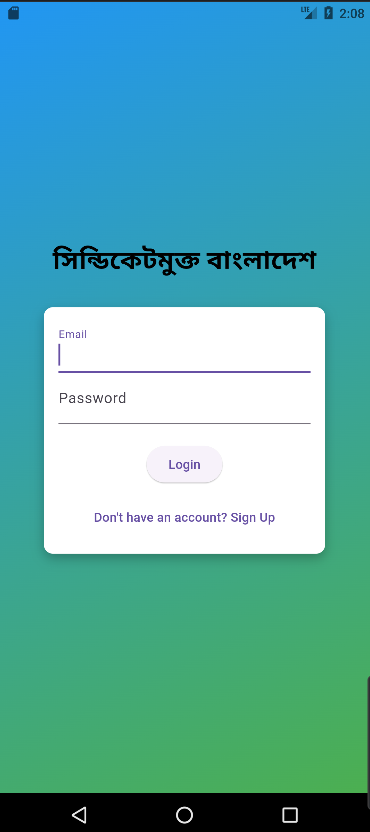

# syndicateless_bd

"সিন্ডিকেটমুক্ত বাংলাদেশ" App
Description: "সিন্ডিকেটমুক্ত বাংলাদেশ" is an innovative Flutter-based mobile application designed to create a marketplace that connects buyers and sellers while promoting transparency and fair trade. The app features a streamlined user experience with easy navigation and essential functionalities that facilitate buying and selling products based on regional preferences.

Key Features:

User Authentication: Secure sign-up and login functionalities with email, password, National ID (NID), and mobile number verification.

Role Selection: On the homepage, users can select their role as a buyer or seller.

Seller Functionality: Sellers can easily add product details including product name, price, and region.

Buyer Functionality: Buyers can view products filtered by their region, ensuring they find what they need quickly and conveniently.

Data Storage: Uses sqflite for local database management, ensuring that user and product data are securely stored and easily accessible offline.

Logout Option: Easy logout feature for user convenience and security.

Consistent Design: Aesthetic design with a gradient background, large buttons for easy interaction, and cohesive app bar styling across all pages.

With its user-friendly interface and robust features, "সিন্ডিকেটমুক্ত বাংলাদেশ" empowers users to engage in a marketplace that is free from unfair practices, fostering an environment of trust and efficiency. This app stands as a testament to modern technology's potential to drive positive change in local commerce.

## Getting Started

This project is a starting point for a Flutter application.

A few resources to get you started if this is your first Flutter project:

- [Lab: Write your first Flutter app](https://docs.flutter.dev/get-started/codelab)
- [Cookbook: Useful Flutter samples](https://docs.flutter.dev/cookbook)

For help getting started with Flutter development, view the
[online documentation](https://docs.flutter.dev/), which offers tutorials,
samples, guidance on mobile development, and a full API reference.
